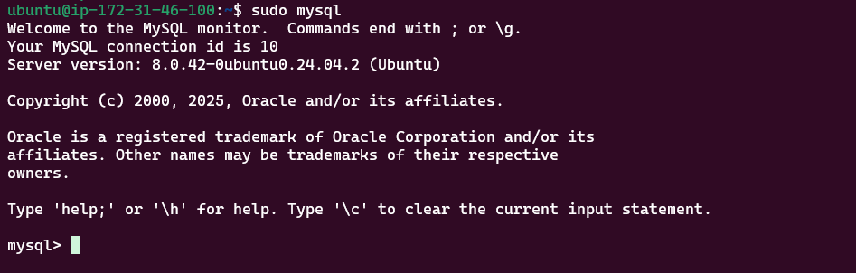

# 🌐 Web Stack Implementation (LAMP Stack) in AWS

This project demonstrates the setup and deployment of a **LAMP (Linux, Apache, MySQL, PHP)** web server stack on an **Amazon EC2 instance**. It is part of a hands-on DevOps/Cloud learning experience focused on Infrastructure provisioning, configuration, and automation on AWS.

---

## 📌 Table of Contents

- [Overview](#overview)
- [Architecture](#architecture)
- [Technologies Used](#technologies-used)
- [Prerequisites](#prerequisites)
- [Setup Guide](#setup-guide)
- [Testing](#testing)
- [Security](#security)
- [License](#license)

---

## 📖 Overview

A **LAMP stack** is a collection of open-source software used to host dynamic websites and web applications. This project involves provisioning a virtual server (EC2) on AWS and installing/configuring:

- **Linux** – Ubuntu Server
- **Apache** – Web Server
- **MySQL** – Database Server
- **PHP** – Server-side scripting

---

## 🧱 Architecture

```plaintext
User → Internet → AWS EC2 (Ubuntu) → Apache → PHP → MySQL
```

- EC2 Instance (Ubuntu 20.04)
- Security Group (HTTP, SSH, MySQL access)
- Apache HTTP Server
- MySQL Database Server
- PHP and PHP modules

---

## 🛠 Technologies Used

- ✅ AWS EC2 (Ubuntu)
- ✅ Apache2
- ✅ MySQL Server
- ✅ PHP 7.4+
- ✅ Bash Shell Scripting
- ✅ GitHub for version control

---

## 📋 Prerequisites

Before you begin, make sure you have the following:

- AWS Account
- SSH Key pair
- IAM user with EC2 permissions
- Git installed on your local machine
- Basic understanding of Linux commands

---

## ⚙️ Setup Guide

### 1. Launch EC2 Instance

- Register a new AWS account
- Choose Ubuntu Server 20.04
- Configure instance type (e.g., t2.micro – Free Tier)
- Add inbound rules for:
  - SSH (port 22)
  - HTTP (port 80)
  - MySQL (port 3306) [Optional – for remote access]


### 2. Change permmission on .pem file and connect via SSH

- Change permissions for the private key file (.pem), otherwise you will get bad permissions
```bash
chmod 0400 your-key.pem
```

- Connect to the instance using the bash script below
```
ssh -i your-key.pem ubuntu@your-ec2-public-ip
```

### 3. Update System Packages

```bash
sudo apt update && sudo apt upgrade -y
```

### 4. Install Apache

```bash
sudo apt install apache2 -y
```

Visit `http://<your-ec2-public-ip>` to verify Apache is running.

### 5. Installation and configuration of MySQL

- Run the below command to install MySQL 
```bash
sudo apt install mysql-server -y
sudo mysql_secure_installation
```
- Login to MySQL
```bash
sudo mysql
```



- Set the password
```MySQL
ALTERUSER'root'@'localhost' IDENTIFIED WITH mysql_native_password BY'P@ssw0rd';
```
- Exit the MySQL shell
```MySQL
exit;
```
- Start the interactive script by running 
```bash
sudo mysql_secure_installation
```
- When you are done with the interactive script, trying logging in with the command below
```bash
sudo mysql -p
```
It will prompt you for password used after changing the root password

### 6. Install PHP
You have Apache installed to serve your content and MySQL installed to store and manage your data. [PHP](https://www.php.net/) is the component of our setup that will process code to display dynamic content to the end user. In addition to the `php` package, you’ll need `php-mysql`, a PHP module that allows PHP to communicate with MySQL-based databases. You’ll also need `libapache2-mod-php` to enable Apache to handle PHP files. Core PHP packages will automatically be installed as dependencies.

- To install these 3 packages at once, run:
```bash
sudo apt install php libapache2-mod-php php-mysql -y
```
- Once the installation is dne, you can run the following command to confirm the PHP version
```bash
php -v
```

### 7. Test PHP
To test your setup with a PHP script, it’s best to set up a proper [Apache Virtual Host](https://httpd.apache.org/docs/current/vhosts/) to hold your website’s files and folders. Virtual host allows you to have multiple websites located on a single machine and users of the websites will not even notice it.
- Create a virtual host for your website using Apache
```bash
sudo mkdir /var/www/projectlamp
```
- You need to assign ownership of the directory with the `$USER` environment variable, which will reference the current system user
```bash
sudo chown -R $USER:$USER /var/www/projectlamp
```
- Then, create and open a new configuration file in Apache's sites-available directiry using your preffered command-line editor. I will ne using `vi` or `vim` 
```bash
sudo vi /etc/apache2/sites-available/projectlamp.conf
```
- Copy and paste the text below
```apacheconf
<VirtualHost *:80>
    ServerName projectlamp
    ServerAlias www.projectlamp
    ServerAdmin webmaster@localhost
    DocumentRoot /var/www/projectlamp
    ErrorLog ${APACHE_LOG_DIR}/error.log
    CustomLog ${APACHE_LOG_DIR}/access.log combined
</VirtualHost>
```
- To save, hit `esc` button then type `wq` and hit `ENTER` on the keyboard
- You can use the `ls` command to show the new file in the `sites-available` directory
```bash
sudo ls /etc/apache2/sites-available
```
- Use the `a2ensite` command to enable the newvirtual host
```bash
sudo a2ensite projectlamp
```
- Disable the default that comes with Apache
```bash
sudo a2dissite 000-default
```
- To make sure your configuration file doesn't contain syntax errors, run;
```bash
sudo apache2ctl configtest
```
- Finally, reload Apache so these changes take effect
```bash
sudo systemctl reload apache2
```
- The new website is active, but the web root */var/www/projectlamp* is still empty. create an index.ht,l file in that location
```bash
sudo echo 'Hello LAMP from hostname' $(TOKEN=`curl -X PUT
"http://169.254.169.254/latest/api/token" -H "X-aws-ec2-metadata-token-ttl-seconds: 21600"` &&
curl -H "X-aws-ec2-metadata-token: $TOKEN" -s http://169.254.169.254/latest/meta-data/public-
hostname) 'with public IP' $(TOKEN=`curl -X PUT "http://169.254.169.254/latest/api/token" -H "X-
aws-ec2-metadata-token-ttl-seconds: 21600"` && curl -H "X-aws-ec2-metadata-token: $TOKEN" -s
http://169.254.169.254/latest/meta-data/public-ipv4) > /var/www/projectlamp/index.html
```

### 8. Enable PHP on the website
By default, Apache's DirectoryIndex settings prioritize `index.html` over `index.php`. This behavior is useful for setting up a temporary "maintenance page" by creating an index.html file with an informative message. This index.html page will be served to visitors instead of the regular `index.php` application page. Once maintenance is complete, renaming or removing index.html will revert the site back to the standard application page.

To change this default behavior and have index.php take precedence, you need to edit the `/etc/apache2/mods-enabled/dir.conf` file and change the order of files listed in the DirectoryIndex directive.

```bash
sudo vim /etc/apache2/mods-enabled/dir.conf
```

After saving and closing the file, you will need to reload Apache for the changes to take effect

```bash
sudo systemctl reload apache2
```

## ✅ Testing

create a new PHP script to test that PHP is correctly installed and configured on your server.

```bash
echo "<?php phpinfo(); ?>" | sudo tee /var/www/projectlamp/index.php
```

- Open browser and enter: `http://<your-ec2-public-ip>`
- Test Apache, PHP, and Database connection using a test page.


## 🔐 Security

- Delete `index.php` after testing to avoid exposing server info:
  
  ```bash
  sudo rm /var/www/projectlamp/index.php
  ```

---

## 📄 License

This project is licensed under the MIT License.

---

## 👨‍💻 Author

**Peter Lemule**  
📎 [GitHub](https://github.com/lems01) | 🔗 [LinkedIn](https://linkedin.com/in/peter-lemule-025a70136)s
